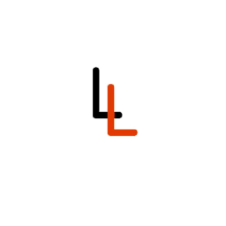

# Loralore - 洛尔科技工作室官方网站

<div align="center">
  
  <p><em>创新驱动未来，技术成就梦想</em></p>
</div>

## 📌 项目概述

Loralore（洛尔科技工作室）是联合创立的跨校技术团队。我们致力于开发创新性技术解决方案，涵盖微信小程序、桌面应用、Web应用以及算法研究等多个领域。本项目为洛尔科技工作室的官方网站，展示我们的团队理念、技术能力和项目成果。

### 🔗 在线预览

- **网站地址**：[https://sippyyuhao.github.io/Loralore/](https://sippyyuhao.github.io/Loralore/)
- **更新频率**：每周更新

## ✨ 网站特色

### 视觉设计
- **响应式布局**：完美适配从手机到大屏设备的各种屏幕尺寸
- **现代化UI**：采用扁平化与微立体结合的设计风格，视觉效果简洁大方
- **动态元素**：整合Particles.js打造动态粒子背景，提升用户视觉体验

### 功能模块
- **3D旋转画廊**：创新性项目展示方式，支持交互操作
- **团队展示**：展现跨校合作团队的组成与专业背景
- **项目详情**：深入介绍各个项目的技术细节与应用场景
- **联系表单**：基于FormSpree的无后端表单解决方案
- **访问统计**：集成百度统计，实时监控网站访问数据

## 🛠️ 技术架构

### 前端技术
- **HTML5**：语义化标签构建页面结构
- **CSS3**：
  - Flexbox和Grid布局系统
  - 媒体查询实现响应式设计
  - CSS变量管理主题色彩
  - CSS动画与过渡效果
- **JavaScript**：
  - 原生ES6+语法
  - DOM操作与事件处理
  - 异步加载与表单处理
  - 浏览器本地存储

### 第三方库与工具
- **Particles.js**：粒子效果背景
- **Font Awesome 4.7.0**：图标库
- **FormSpree**：表单处理服务
- **百度统计**：网站数据分析

### 开发工具
- **Git & GitHub**：版本控制与协作
- **VSCode**：代码编辑器
- **Chrome DevTools**：前端调试

## 📂 项目结构

```
Loralore/
│
├── index.html             # 主页面
├── thanks.html            # 表单提交感谢页面
├── favicon.ico            # 网站图标
├── README.md              # 项目说明文档
│
├── css/                   # 样式文件
│   └── style.css          # 主样式表
│
├── js/                    # JavaScript文件
│   ├── script.js          # 主脚本文件
│   ├── particles.js       # 粒子效果库
│   └── particles/         # 粒子效果配置
│       └── config.js      # 粒子系统配置文件
│
└── images/                # 图片资源
    ├── logo.png           # 工作室标志
    ├── showcase.jpg       # 展示背景
    ├── school logos/      # 学校标志
    └── project-images/    # 项目图片
```

## 🚀 本地开发指南

### 环境准备
- 现代浏览器（Chrome, Firefox, Edge等）
- 文本编辑器（推荐VSCode）

### 获取代码
```bash
# 克隆仓库
git clone https://github.com/Sippyyuhao/Loralore.git

# 进入项目目录
cd Loralore
```

### 运行项目
由于项目是纯前端实现，无需构建步骤，可直接在浏览器中打开：

```bash
# Windows
start index.html

# macOS
open index.html

# Linux
xdg-open index.html
```

### 开发建议
- 使用浏览器开发工具进行调试
- 测试不同屏幕尺寸的响应式效果
- 验证表单功能的正确性

## 📤 部署流程

### GitHub Pages部署（推荐）

1. **自动部署**
   我们配置了GitHub Actions工作流，每次推送到main分支会自动部署：

   ```bash
   git add .
   git commit -m "描述你的更新内容"
   git push origin main
   ```

2. **手动部署**（备选方案）
   ```bash
   # 确保所有更改已提交
   git add .
   git commit -m "网站更新: 描述更新内容"
   
   # 推送到GitHub
   git push origin main
   ```

### 自定义域名配置（可选）
1. 在DNS提供商处添加CNAME记录，指向`sippyyuhao.github.io`
2. 在仓库根目录创建CNAME文件，内容为自定义域名
3. 在GitHub仓库设置中配置Custom domain

## 👥 团队成员

Loralore是一支充满活力的跨校学生团队，成员来自：
- **广东海洋大学**：主要负责算法研究与后端开发
- **广东外语外贸大学**：负责UI/UX设计与前端实现
- **华南师范大学**：负责数据分析与产品管理
- **湖北科技学院**：负责移动端开发与测试

## 📞 联系我们

- **开发者邮箱**：2684373547@qq.com
- **工作室邮箱**：sippyyuhao@hotmail.com
- **GitHub主页**：[https://github.com/Sippyyuhao](https://github.com/Sippyyuhao)

## 📜 版权声明

版权所有 © 2025 Loralore 洛尔科技工作室。保留所有权利。

---

<div align="center">
  <p>用创意改变世界 | 技术驱动未来 | 跨校合作共赢</p>
</div> 